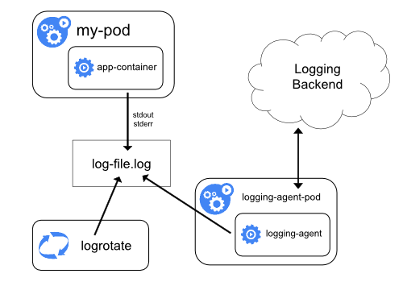
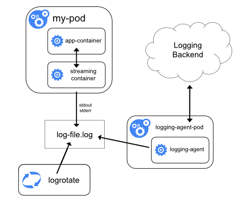

# Logging
***

쿠버네티스에서의 로깅은 시스템 상태, 애플리케이션의 로그를 확인하는 것을 말한다.

### Pod & Container log
- 컨테이너화된 애플리케이션은 로그를 stdout/stderr에 기록.
    - 이 출력을 컨테이너 런타임이 파일로 저장. -> 이걸 `kubectl logs`로 확인하는 거임.
- `kubectl logs <pod-name> -c <container-name`
    - 멀티 컨테이너 파드에서는 `-c` 플래그로 컨테이너 지정 필요.
- 근데 로그가 노드의 로컬 디스크에 저장되기 때문에 해당 컴포넌트가 사라지면 로그도 사라진다.

### Log Rotation
- Pod의 로그가 계속 쌓이면 리소스를 잡아먹기 때문에 문제가 된다.
- Kubelet이 설정된 maxSize를 바탕으로 로그 파일 개수를 제한한다.
- `kubectl logs`는 최신 1개 로그만 보는 거임.

### Cluster Level logging
- 각 노드에 노드-레벨 로깅 에이전트 사용
  - DaemonSet

- Streaming-Sidecar
  - 로그-에이전트를 돌려서 애플리케이션에서 수집
  - 메인 컨테이너가 기록한 로그를 스트리밍해서 자신의 표준출력에 내보내서 에이전트가 읽게 하는 방법

- Logging Agent Sidecar
  - 메인 컨테이너는 로그 파일로 기록 
  - 사이드카 컨테이너가 Fluentd, Vector 등의 로깅 에이전트를 실행 
  - 자체 설정을 통해 로그를 수집, 외부 전송
  - kubelet이 로그를 관리하지 않기 때문에 `kubectl logs` 사용불가 

- 애플리케이션에서 직접 보내주기