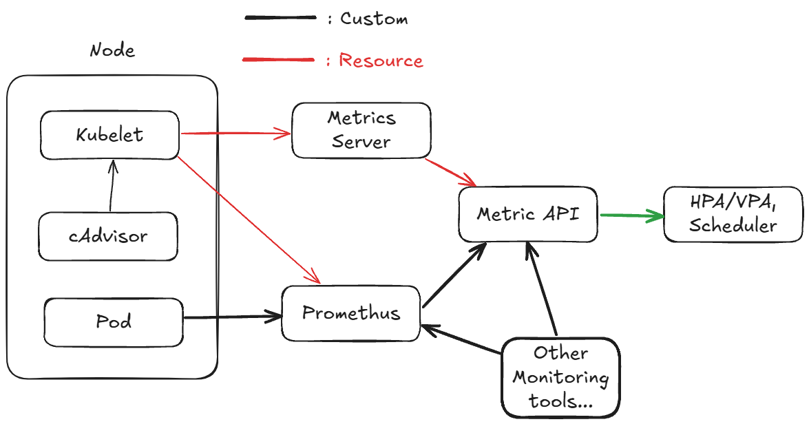

# Monitoring
***

쿠버네티스에서의 주요 모니터링 대상은 다음과 같다.
- Node: 노드 수, 상태, 리소스 사용량
- Pod: 파드 수, 상태, 리소스 사용량
- Container: 상태, 리소스 샤용량
- Custom Metrics: 애플리케이션에서 나오는 지표들
- Kubernetes: 시스템 자체 모니터링

### Metrics Server - Resource Metrics Pipeline
- 쿠버네티스에서는 기본적으로 Metrics Server를 이용해 모니터링 기능을 제공한다.
  - Node Metric
  - Pod Metric
- 이를 **인 메모리**에 저장하기 때문에 과거 이력은 조회할 수 없으니 주의해야 한다.
- 각 노드의 Kubelet이 cAdvisor를 통해 메트릭들을 받아와서 Metrics Server에 보내준다.
- `kubectl top` 명령어를 통해 Metrics Server에서 받는 정보들을 볼 수 있다.
- 이러한 지표를 가지고 HPA, 스케줄러 등에서 사용.

### 그럼 더 지표를 수집하고 싶으면? - Full Metrics Pipeline
- 쿠버네티스에서 제공하는 모니터링은 위가 끝이다. 따라서 별도의 도구를 사용해야 한다.
  - 프로메테우스: Pod안 애플리케이션으로부터 여러 지표 수집 + 커스텀 metrics
- 이에 대한 자세한 내용은 아래의 링크를 참고하면 좋을 것 같다.
- https://www.samsungsds.com/kr/insights/kubernetes_monitoring.html\

