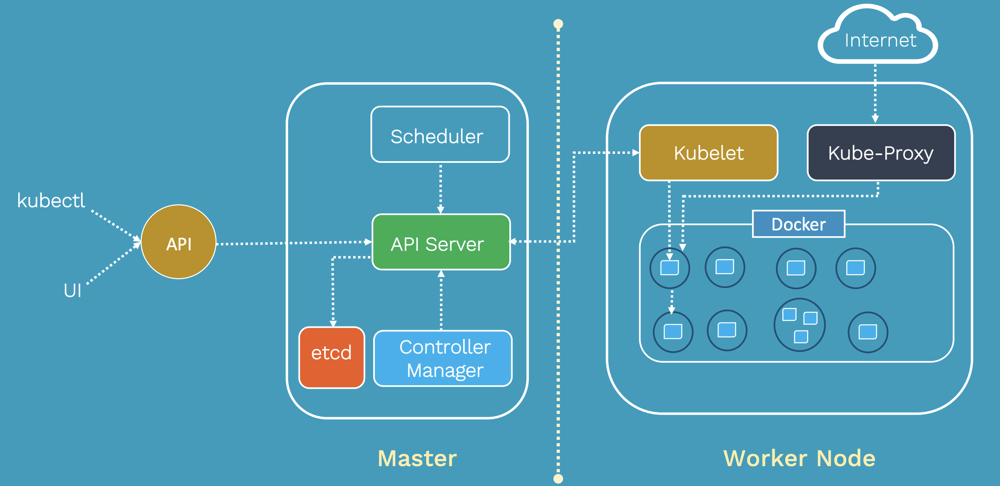

# 아키텍처

- 출처: https://tkssharma.com/kubernetes_architecture/

## 마스터와 노드
***
쿠버네티스는 마스터와 노드 두 개의 컴포넌트로 구분된다.
마스터는 전체 클러스터를 관리하고, 노드는 Pod가 실행되는 머신이다.

### 마스터
클러스터 전체를 제어 관리하는 시스템
- API 서버
- 스케줄러
- 컨트롤러 매니저
- ETCD
*컨트롤 플레인 컴포넌트

### API 서버
클러스터와 상호작용하는 모든 요청의 관문이며, 모든 컴포넌트는 API 서버를 통해 리소스에 접근할 수 있다.
- etcd와 유일하게 직접 연결 가능.

### Etcd
쿠버네티스의 데이터베이스 역할로 모든 상태 정보를 저장하는 키-값 저장소이다.
- 서버 설정값
- 클러스터 상태
- 인증 정보

### 스케줄러
클러스터 내에 새로운 Pod를 적절한 노드에 배치하는 역할을 한다.
- Predicate: taint/toleration, Node 상태
- Scoring: 우선순위, 리소스 여유, 분산도

### 컨트롤러 매니저
여러 컨트롤러를 생성하고, 이를 각 노드에 배포하여 관리하는 역할.

### DNS
쿠버네티스는 리소스의 엔드포인트를 DNS로 맵핑하고 관리한다. Pod는 생명주기마다 IP가 동적으로 바뀌는데 리소스의 IP와 DNS이름을 매핑해
이를 기반으로 리소스에 접근할 수 있게 한다.

### 노드
마스터에 의해 명령을 받고 실제 워크로드를 생성하여 서비스하는 컴포넌트
- Kubelet
- Kube-proxy
- 컨테이너 런타임
- cAdvisor

### Kubelet
각 노드에 설치되는 핵심 에이전트로, Pod를 실행하고 관리한다. 또한, 노드의 상태를 API 서버에 보고한다.
- Pod 수신
- 컨테이너 실행
- 상태 확인
- 상태 보고
- 정리 및 재시작
- 볼륨 마운트

### Kube-proxy
노드로 들어오는 네트워크 트래픽을 적절한 컨테이너로 라우팅하고, 로드밸런싱, 네트워크 프록시, 클러스터 내 Pod 간 통신을 담당한다.

### 컨테이너 런타임
컨테이너를 실행하는 엔진이다.
- containerd

### cAdvisor
컨테이너의 리소스 사용량을 모니터링 하기 위한 도구

***
참고
- https://bcho.tistory.com/1258
- Mumshad CKA lecture